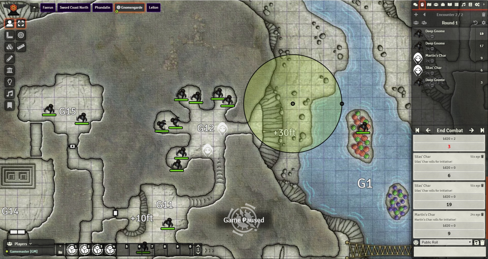
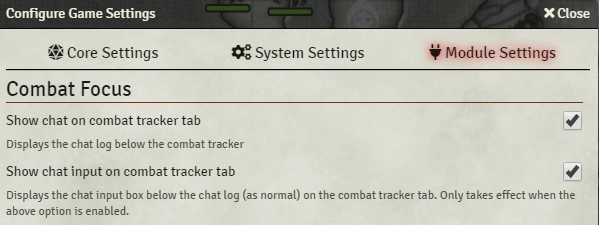

# Foundry Combat Focus

FoundryVTT-addon that shows the chat and the combat tracker at the same time. The point is to reduce the amount of 
switching players need to do between the combat tracker (to see who's turn it is) and the chat (to see the results 
of their and other peoples' actions).  

Features:

- Shows the chat window on the combat tracker tab (below the turn order)
- Can be enabled / disabled in the module settings by every player (might not work great on small screens).
- The height ratio between the combat tracker and the chat can be adjusted by dragging a handle between the two by each player individually

Screenshots: 

If you want to show your support for my work financially, feel free to donate via PayPal - it's greatly appreciated! 

